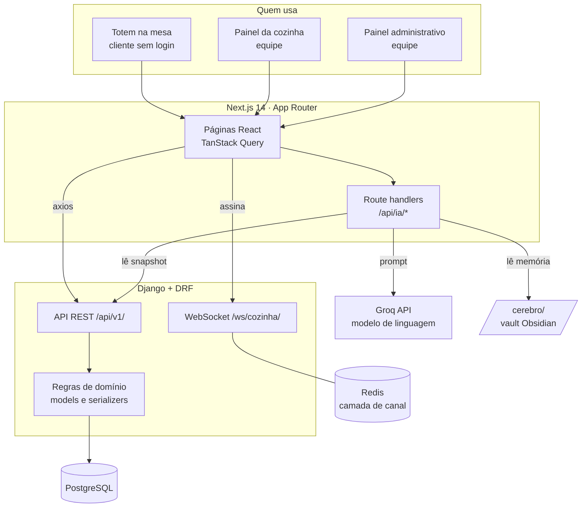

# Arquitetura

## Visão geral



A chave da Groq nunca chega ao navegador: quem fala com o modelo é o servidor do Next.

## Fluxo de um pedido

```mermaid
sequenceDiagram
    participant C as Cliente (totem)
    participant N as Next.js
    participant D as Django
    participant B as Banco
    participant K as Cozinha

    C->>N: monta o carrinho
    C->>D: POST /api/v1/pedidos/
    D->>D: valida itens e disponibilidade
    D->>B: grava pedido + itens com preço congelado
    D->>B: marca a mesa como ocupada
    D-->>C: 201 com o número do pedido
    D->>K: evento no WebSocket (aviso curto)
    K->>D: GET /api/v1/pedidos/?aberto=true
    K->>D: POST /pedidos/{id}/status/ (avança etapa)
    D->>D: valida a transição
    D->>B: atualiza status; libera a mesa se foi o último
```

## Decisões de projeto

Cada uma existe por um motivo, e o motivo importa mais que a escolha.

### O preço fica congelado no item do pedido

`ItemPedido.preco_unitario` guarda o preço no momento da venda, em vez de ler
`Produto.preco` na hora de exibir. Sem isso, um reajuste de cardápio reescreveria o
faturamento de ontem. É a mesma razão pela qual nota fiscal guarda valor, não referência.

### O WebSocket avisa, a API entrega

O evento enviado à cozinha carrega apenas identificador, status e se é novo. A tela então
busca a fila pela API. Se o payload trouxesse os dados, duas fontes poderiam divergir, e
uma reconexão perdida deixaria a cozinha com informação velha sem perceber.

### A busca periódica continua existindo

Mesmo com WebSocket, a cozinha continua consultando a API, só que a cada 30s em vez de 5s.
Serve como rede de segurança: se o socket cair sem avisar, a tela se recupera sozinha.

### Fluxo de status é máquina de estados explícita

`Pedido.TRANSICOES` declara o que pode virar o quê. Um pedido pronto não volta para
"em preparo" e não pode ser cancelado, porque o prato já foi feito e o prejuízo já existe.
A validação fica no serializer, então vale para qualquer cliente da API, não só para a tela.

### Criar pedido é público, ver a fila não é

Quem cria o pedido é o cliente na mesa, que não tem conta e não deveria ter. Já a fila e o
histórico são operação interna. Por isso `PermissaoPedido` libera só o `create`.

### A camada de canal é escolhida por alcance, não por configuração

`REDIS_URL` aponta para o host `redis` no Docker Compose. Fora do Docker esse nome não
resolve, e o WebSocket morria tentando conectar. O `settings.py` testa se o host resolve
antes de escolher Redis, caindo para a camada em memória quando não resolve.

### O cérebro da IA vive dentro do frontend

`frontend/cerebro/` é um vault Obsidian lido em tempo de execução pelas rotas de IA. Ficava
na raiz do repositório, mas a Vercel só envia o diretório configurado como raiz do projeto,
e em produção a IA perdia a memória. O `next.config.js` ainda declara `outputFileTracingIncludes`,
porque leitura por `fs` não é rastreável estaticamente pelo Next.

### Precedência entre banco e cérebro

O system prompt tem três camadas: persona, cérebro da conta e retrato ao vivo do banco.
Em conflito de preço ou disponibilidade, vale o banco. O cérebro guarda o que o banco não
sabe: tom de voz, história da casa, regras internas.

## Estrutura de pastas

```
backend/
  smartfood/          configuração, ASGI, permissões e autenticação
  apps/categorias/    categorias do cardápio
  apps/produtos/      itens do cardápio
  apps/mesas/         salão
  apps/pedidos/       pedido, itens, fila, WebSocket e seed
frontend/
  src/app/            páginas e route handlers
  src/lib/api.ts      cliente HTTP e interceptors de token
  src/lib/auth/       sessão da equipe
  src/lib/ia/         persona, snapshot e cérebro
  src/lib/pedidos/    assinatura da fila ao vivo
  cerebro/            vault Obsidian, memória por conta
docs/                 esta documentação
```
