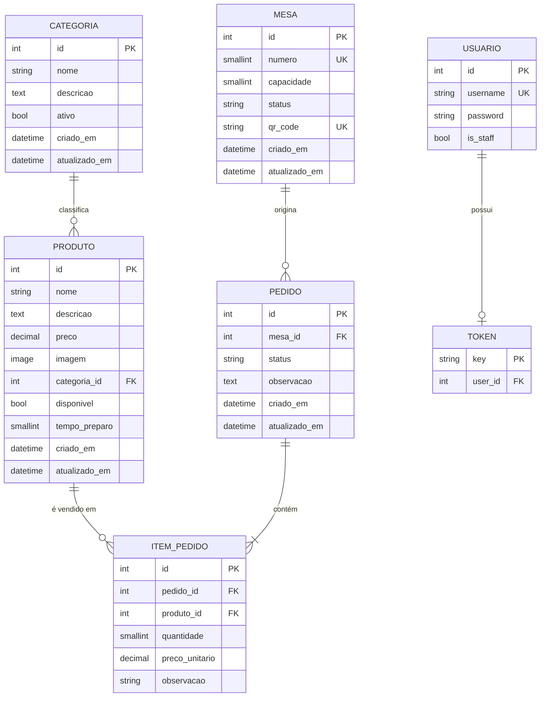
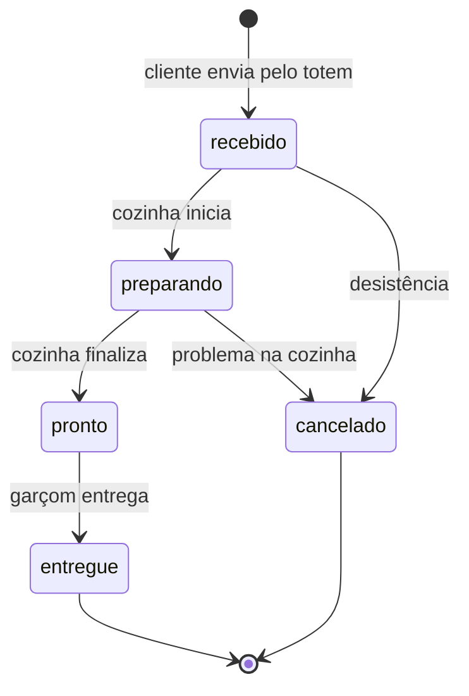

# Modelo de dados

## Diagrama entidade-relacionamento

## Dicionário de dados

### Categoria

| Campo | Tipo | Regra |
|-------|------|-------|
| nome | varchar | Nome exibido no cardápio |
| descricao | text | Opcional |
| ativo | boolean | Categoria inativa não deveria aparecer ao cliente |

### Produto

| Campo | Tipo | Regra |
|-------|------|-------|
| nome | varchar | Nome do prato |
| descricao | text | Texto de vitrine, opcional |
| preco | decimal | Preço atual do cardápio, não o preço histórico |
| imagem | arquivo | Upload tratado com Pillow |
| categoria | FK | Protegida contra exclusão em cascata indevida |
| disponivel | boolean | `false` bloqueia a inclusão em novos pedidos |
| tempo_preparo | smallint | Minutos; alimenta a estimativa mostrada ao cliente |

### Mesa

| Campo | Tipo | Regra |
|-------|------|-------|
| numero | smallint | Único no salão |
| capacidade | smallint | Padrão 4 lugares |
| status | varchar | `disponivel`, `ocupada`, `reservada`, `manutencao` |
| qr_code | varchar | Gerado como `mesa-<numero>` quando vazio |

O status é mantido pelo sistema: abrir pedido ocupa a mesa, e fechar o último pedido dela
devolve para disponível.

### Pedido

| Campo | Tipo | Regra |
|-------|------|-------|
| mesa | FK | `PROTECT`: mesa com histórico não é apagada por engano |
| status | varchar | `recebido`, `preparando`, `pronto`, `entregue`, `cancelado` |
| observacao | text | Observação geral do pedido |

Campos calculados, expostos pela API e não gravados: `total`, `quantidade_itens` e
`tempo_preparo_estimado`, este último igual ao item mais demorado, porque a cozinha
trabalha em paralelo.

### ItemPedido

| Campo | Tipo | Regra |
|-------|------|-------|
| pedido | FK | `CASCADE`: item não existe sem o pedido |
| produto | FK | `PROTECT`: produto vendido não some do histórico |
| quantidade | smallint | Mínimo 1 |
| preco_unitario | decimal | **Congelado** no momento do pedido |
| observacao | varchar | "sem cebola", "bem passado" |

## Máquina de estados do pedido

Depois de `pronto` não há cancelamento: o prato existe e o custo já foi incorrido. Qualquer
outra transição é recusada pela API com HTTP 400.
