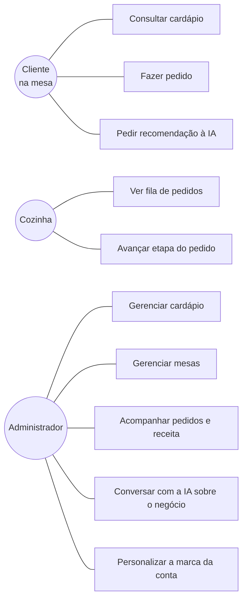

# Casos de uso

## UC02 · Fazer pedido

**Ator**: cliente na mesa. **Pré-condição**: mesa cadastrada e cardápio com itens disponíveis.

1. O cliente lê o QR code da mesa e abre o totem.
2. Escolhe a mesa (ou ela já vem pelo QR).
3. Navega pelo cardápio, filtrando por categoria.
4. Adiciona itens ao carrinho e ajusta quantidades.
5. Confirma o pedido.
6. O sistema valida a disponibilidade de cada item e grava o pedido com o preço atual.
7. A mesa passa a ocupada e a cozinha é avisada na hora.
8. O cliente vê o número do pedido, o resumo e o tempo estimado.

**Fluxo alternativo 6a**: item ficou indisponível entre a escolha e o envio. O sistema
recusa o pedido inteiro e informa qual item saiu, sem gravar nada pela metade.

**Fluxo alternativo 6b**: API fora do ar. O totem avisa que não conseguiu enviar e orienta
chamar o atendimento, em vez de fingir sucesso.

## UC05 · Avançar etapa do pedido

**Ator**: cozinha. **Pré-condição**: sessão autenticada.

1. A cozinha vê a fila em três colunas: novos, em preparo, prontos.
2. Toca na ação do cartão para avançar a etapa.
3. O sistema valida a transição contra a máquina de estados.
4. O cartão muda de coluna e todos os painéis conectados são atualizados.
5. Ao marcar como entregue, a mesa é liberada se não houver outro pedido aberto nela.

**Fluxo alternativo 3a**: transição inválida (pular etapa, voltar, cancelar depois de
pronto). A API recusa com 400 e a tela mantém o estado anterior.

## UC08 · Acompanhar pedidos e receita

**Ator**: administrador. **Pré-condição**: sessão autenticada.

1. Abre a tela de pedidos.
2. Vê receita do dia, número de pedidos, ticket médio e mesas atendidas.
3. Filtra por status e inspeciona itens e valores de cada pedido.

**Regra**: a receita conta apenas pedidos entregues. Pedido em preparo ainda pode ser
cancelado, e contá-lo inflaria o faturamento.

## UC09 · Conversar com a IA sobre o negócio

**Ator**: administrador.

1. Abre Conversas e escolhe a conta na caixa de entrada.
2. Escreve a pergunta.
3. O servidor monta o prompt com persona, cérebro da conta e retrato ao vivo do banco.
4. A resposta chega em streaming.
5. Se quiser, o administrador ensina um fato novo, que vira memória permanente da conta.

**Regra**: sem dado no contexto, a IA declara que não tem a informação. Não inventa número,
preço ou prato.
